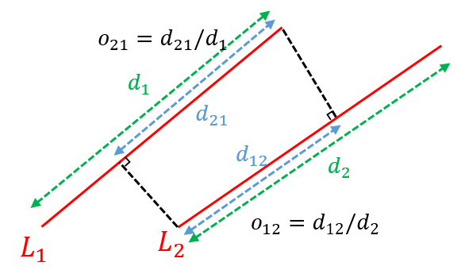

\#: corresponding author
## 2024
<!-- <table style="width:100%;border-spacing:0px;margin:auto;"> -->
<table style="width:100%; border-collapse: collapse; border: none; border-spacing: 0px; margin:auto;">
  <tr>
    <td style="padding:10px;width:35%;vertical-align:middle; border:none;">
      
    </td>
    <td style="padding:10px;width:65%;vertical-align:middle; font-size:18px; border:none;">
      <strong><a href="https://dl.acm.org/doi/10.1145/3707446">LiDAR-based Place Recognition for Autonomous Driving: A Survey</a></strong>
       
      Yongjun Zhang, <strong>Pengcheng Shi</strong>#, Jiayun Li#
       
      <em>ACM Computing Surveys (CSUR), 2024, Impact Factor: 23.8</em>
       
      <a href="https://dl.acm.org/doi/10.1145/3707446">[Paper]</a>
      <a href="https://github.com/ShiPC-AI/LPR-Survey">[Code]</a>
    </td>
  </tr>

  <tr>
    <td style="padding:10px;width:35%;vertical-align:middle; border:none;">
      
    </td>
    <td style="padding:10px;width:65%;vertical-align:middle; font-size:18px; border:none;">
      <strong><a href="https://ieeexplore.ieee.org/document/10758239">RANSAC Back to SOTA: A Two-stage Consensus Filtering for Real-time 3D Registration</a></strong>
       
      <strong>Pengcheng Shi</strong>, Shaocheng Yan, Yilin Xiao, Xinyi Liu, Yongjun Zhang#, Jiayuan Li#
       
      <em>IEEE Robotics and Automation Letters (RAL), 2024, Impact Factor: 4.6</em>
       
      <a href="https://ieeexplore.ieee.org/document/10758239">[Paper]</a>
      <a href="https://github.com/ShiPC-AI/TCF">[Code]</a>
      <a href="https://drive.google.com/drive/folders/1uKN2pqymFc85tY13Cw7kUNop7uQOEOSB">[Dataset]</a>
    </td>
  </tr>

  <tr>
    <td style="padding:10px;width:35%;vertical-align:middle; border:none;">
      
    </td>
    <td style="padding:10px;width:65%;vertical-align:middle; font-size:18px; border:none;">
      <strong><a href="https://link.springer.com/chapter/10.1007/978-3-031-72784-9_2">ML-SemReg: Boosting Point Cloud Registration with Multi-level Semantic Consistency</a></strong>
       
      Shaocheng Yan, <strong>Pengcheng Shi</strong>, Jiayuan Li#
       
      <em>European Conference on Computer Vision (ECCV), 2024</em>
       
      <a href="https://link.springer.com/chapter/10.1007/978-3-031-72784-9_2">[Paper]</a>
      <a href="https://github.com/Laka-3DV/ML-SemReg">[Code]</a>
    </td>
  </tr>

  <tr>
    <td style="padding:10px;width:35%;vertical-align:middle; border:none;">
      
    </td>
    <td style="padding:10px;width:65%;vertical-align:middle; font-size:18px; border:none;">
      <strong><a href="https://onlinelibrary.wiley.com/doi/full/10.1111/phor.12497">3D LiDAR SLAM: A Survey</a></strong>
       
      Yongjun Zhang, <strong>Pengcheng Shi</strong>#, Jiayun Li#
       
      <em>Photogrammetric Record (PHOR), 2024, Impact Factor: 2.4</em>
       
      <a href="https://onlinelibrary.wiley.com/doi/full/10.1111/phor.12497">[Paper]</a>
    </td>
  </tr>

  <tr>
    <td style="padding:10px;width:35%;vertical-align:middle; border:none;">
      
    </td>
    <td style="padding:10px;width:65%;vertical-align:middle; font-size:18px; border:none;">
      <strong><a href="https://ieeexplore.ieee.org/abstract/document/10416737">A New Horizon: Employing Map Clustering Similarity for LiDAR-based Place Recognition</a></strong>
       
      <strong>Pengcheng Shi</strong>, Yilin Xiao, Wenqing Chen, Jiayuan Li#, Yongjun Zhang#
       
      <em>IEEE Transactions on Intelligent Vehicles (TIV), 2024, Impact Factor: 14.0</em>
       
      <a href="https://ieeexplore.ieee.org/abstract/document/10416737">[Paper]</a>
      <a href="https://github.com/ShiPC-AI/MCS">[Code]</a>
    </td>
  </tr>

  <tr>
    <td style="padding:10px;width:35%;vertical-align:middle; border:none;">
      
    </td>
    <td style="padding:10px;width:65%;vertical-align:middle; font-size:18px; border:none;">
      <strong><a href="http://ch.whu.edu.cn/cn/article/doi/10.13203/j.whugis20220761?viewType=SUP">室内圆柱引导的激光雷达全局定位与回环检测</a></strong>
       
      <strong>史鹏程</strong>, 李加元, 刘欣怡, 张永军#
       
      <em>武汉大学学报信息科学版, 2024</em>
       
      <a href="http://ch.whu.edu.cn/cn/article/doi/10.13203/j.whugis20220761?viewType=SUP">[Paper]</a>
    </td>
  </tr>
</table>

## 2023
<table style="width:100%; border-collapse: collapse; border: none; border-spacing: 0px; margin:auto;">
  <tr>
    <td style="padding:10px;width:35%;vertical-align:middle; border:none;">
      
    </td>
    <td style="padding:10px;width:65%;vertical-align:middle; font-size:18px; border:none;">
      <strong><a href="https://ieeexplore.ieee.org/document/10091912">QGORE: Quadratic-time Guaranteed Outlier Removal for Point Cloud Registration</a></strong>
       
      Jiayun Li, <strong>Pengcheng Shi</strong>, Qingwu Hu#, Yongjun Zhang#
       
      <em>IEEE Transactions on Pattern Analysis and Machine Intelligence (TPAMI), 2023, Impact Factor: 24.3</em>
       
      <a href="https://ieeexplore.ieee.org/document/10091912">[Paper]</a>
    </td>
  </tr>

  <tr>
    <td style="padding:10px;width:35%;vertical-align:middle; border:none;">
      
    </td>
    <td style="padding:10px;width:65%;vertical-align:middle; font-size:18px; border:none;">
      <strong><a href="https://www.sciencedirect.com/science/article/pii/S0924271623001892">A Fast LiDAR Place Recognition and Localization Method by Fusing Local and Global Search</a></strong>
       
      <strong>Pengcheng Shi</strong>, Jiayun Li#, Yongjun Zhang#
       
      <em>ISPRS Journal of Photogrammetry and Remote Sensing (ISPRS P&RS), 2023, Impact Factor: 12.7</em>
       
      <a href="https://www.sciencedirect.com/science/article/pii/S0924271623001892">[Paper]</a>
      <a href="https://github.com/ShiPC-AI/Occupied-Place-Description">[Code]</a>
    </td>
  </tr>

  <tr>
    <td style="padding:10px;width:35%;vertical-align:middle; border:none;">
      
    </td>
    <td style="padding:10px;width:65%;vertical-align:middle; font-size:18px; border:none;">
      <strong><a href="https://www.sciencedirect.com/science/article/pii/S1569843223001589">LiDAR Localization at 100 FPS: A Map-aided and Template Descriptor-based Global Method</a></strong>
       
      <strong>Pengcheng Shi</strong>, Jiayun Li#, Yongjun Zhang#
       
      <em>International Journal of Applied Earth Observation and Geoinformation (JAG), 2023, Impact Factor: 7.6</em>
       
      <a href="https://www.sciencedirect.com/science/article/pii/S1569843223001589">[Paper]</a>
      <a href="https://github.com/ShiPC-AI/LiDAR-Localization-100FPS">[Code]</a>
    </td>
  </tr>
</table>

## 2022
<table style="width:100%; border-collapse: collapse; border: none; border-spacing: 0px; margin:auto;">
  <tr>
    <td style="padding:10px;width:35%;vertical-align:middle; border:none;">
      
    </td>
    <td style="padding:10px;width:65%;vertical-align:middle; font-size:18px; border:none;">
      <strong><a href="https://ieeexplore.ieee.org/abstract/document/9751712">LNIFT: Locally Normalized Image for Rotation Invariant Multimodal Feature Matching</a></strong>
       
      <strong>Jiayuan Li</strong>, Wangyi Xu, **Pengcheng Shi**, Yongjun Zhang#, Qingwu Hu#
       
      <em>IEEE Transactions on Geoscience and Remote Sensing (TGRS), 2022, Impact Factor: 8.2</em>
       
      <a href="https://ieeexplore.ieee.org/abstract/document/9751712">[Paper]</a>
      <a href="https://github.com/LJY-RS/LNIFT_exe">[Code]</a>
    </td>
  </tr>
</table>

## 2021
<table style="width:100%; border-collapse: collapse; border: none; border-spacing: 0px; margin:auto;">
  <tr>
    <td style="padding:10px;width:35%;vertical-align:middle; border:none;">
      
    </td>
    <td style="padding:10px;width:65%;vertical-align:middle; font-size:18px; border:none;">
      <strong><a href="http://xb.chinasmp.com/CN/10.11947/j.AGCS.2021.20210268">顾及室内场景特征的多线激光雷达初始定位</a></strong>
       
      <strong>史鹏程</strong>, 叶勤#, 张绍明, 邓海峰
       
      <em>测绘学报, 2021</em>
       
      <a href="http://xb.chinasmp.com/CN/10.11947/j.AGCS.2021.20210268">[Paper]</a>
    </td>
  </tr>
</table>

## 2020
<table style="width:100%; border-collapse: collapse; border: none; border-spacing: 0px; margin:auto;">
  <tr>
    <td style="padding:10px;width:35%;vertical-align:middle; border:none;">
      
    </td>
    <td style="padding:10px;width:65%;vertical-align:middle; font-size:18px; border:none;">
      <strong><a href="https://www.mdpi.com/2220-9964/9/11/660">A Novel Indoor Structure Extraction Based on Dense Point Cloud</a></strong>
       
      <strong>Pengcheng Shi</strong>, Qin Ye#, Lingwen Zeng
       
      <em>ISPRS International Journal of Geo-Information (IJGI), 2020, Impact Factor: 2.8</em>
       
      <a href="https://www.mdpi.com/2220-9964/9/11/660">[Paper]</a>
    </td>
  </tr>

  <tr>
    <td style="padding:10px;width:35%;vertical-align:middle; border:none;">
      
    </td>
    <td style="padding:10px;width:65%;vertical-align:middle; font-size:18px; border:none;">
      <strong><a href="https://www.mdpi.com/1424-8220/20/8/2299">A Novel Loop Closure Detection Approach Using Simplified Structure for Low-cost LiDAR</a></strong>
       
      <strong>Qin Ye</strong>, **Pengcheng Shi**, Kunyuan Xu, Popo Gui, Shaoming Zhang#
       
      <em>Sensors, 2020, Impact Factor: 3.5</em>
       
      <a href="https://www.mdpi.com/1424-8220/20/8/2299">[Paper]</a>
    </td>
  </tr>
</table>